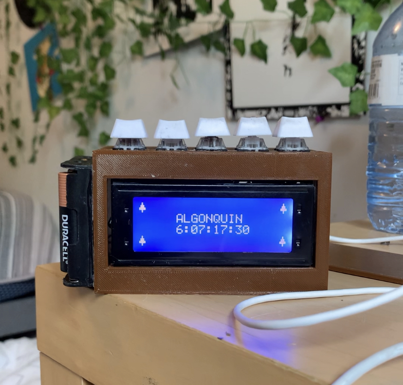

# Notion_Clock
 LCD display that connects to Notion API, kind of an advanced desk clock
## Topics: REST API, 3d modelling

The idea behind this project is a little hard to explain because its more of a personal tool for me than anything
The "box" is programmed to connect to the Notion API and request a database of events
It then grabs all the events that have dates and calculates the time remaining until each, displaying the remaining time on the screen

To practice working with web APIS on the ESP32, I also added weather forecast functionality, making this kind of like an advanced desk clock

### Early prototyping:

